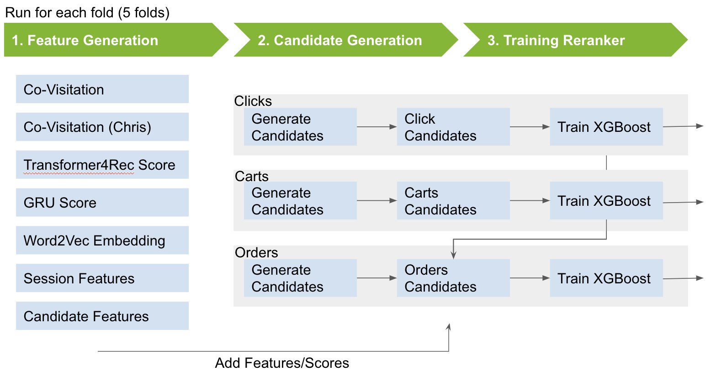
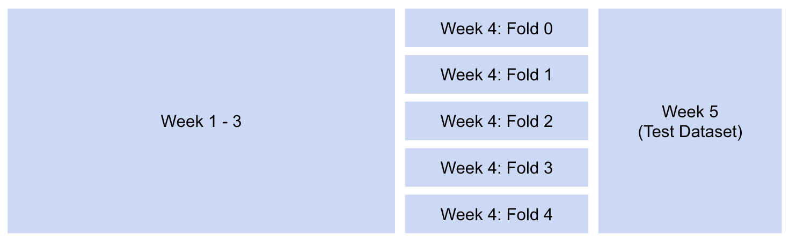

# 3rd Place Solution - Kaggle-OTTO-Comp - Benny's Part

[Otto's Kaggle competition](https://www.kaggle.com/competitions/otto-recommender-system/) was a session-based, multi-task recommender system problem. Otto provided 12M sessions over 4 weeks with clicks, add to carts and orders events for training. Our team ([Chris](https://www.kaggle.com/cdeotte), [Giba](https://www.kaggle.com/titericz) and [Theo](https://www.kaggle.com/theoviel) won the 3rd place and achieved a score of 0.60437 on public LB (private LB 0.60382). Our solution is an ensemble of our individual models. 

My model achieved public LB 0.60102 and private LB 0.6003. This repository contains the code to run my model end-to-end.

I shared [my approach on kaggle write-up](https://www.kaggle.com/competitions/otto-recommender-system/discussion/386497). You can find my teammate's solution: [Chris](https://www.kaggle.com/competitions/otto-recommender-system/discussion/383013) and [Theo](https://www.kaggle.com/competitions/otto-recommender-system/discussion/382975).

## Requirements

The code runs on a single V100 GPU with 32GB memory and ~1.5TB disk space.

I recommend using docker. I used following base image `nvcr.io/nvidia/merlin/merlin-tensorflow:22.12` which includes [RAPIDs cuDF](https://docs.rapids.ai/api/cudf/stable/), TensorFlow, XGBoost, etc.

I install additional libraries:
```
# General
pip install pandarallel

# For Transformer4Rec
pip install torch torchmetrics==0.10.0
cd /nvtabular && git pull origin main && pip install .
cd / && rm -rf dataloader && git clone https://github.com/NVIDIA-Merlin/dataloader.git && cd dataloader && git pull origin main && pip install .
cd / && rm -rf transformers4rec && git clone https://github.com/NVIDIA-Merlin/Transformers4Rec.git && mv Transformers4Rec transformers4rec && cd transformers4rec && git pull origin main && git checkout 851a8903316cccab91850b1e39ade5018b287945 && pip install .

# For Woord2Vec
pip install gensim
```
(If I missed some, a basic pip install should fix it)

#### Symbolic Links

`create_symbolic_links.sh` sets up some symbolic links (see directory explanation below). The pipeline was written where all files were located in one directory. I splitted the files into individual steps to make it easier to understand. 

## Model Summary

I provide a detailed description [here](https://www.kaggle.com/competitions/otto-recommender-system/discussion/386497).



My final model is a similar pipeline as proposed by Chris and described by many top solution. I will briefly summarize my solution:

Pipeline for all targets:<br>
1. Feature Engineering<br>

Pipelines per target:<br>
2. Generating Candidates<br>
3. Add Features/Scores for session x candidate pairs<br>
4. Training a XGBoost model<br>



I splitted my dataset as proposed by Radek and truncated the 4th week. A difference is, that I splitted the 4th week into 5 chunks and comobine only 1 chunk of the truncated sessions of week 4 with the remaining untruncated sessions of week 4. Therefore, some of my pipeline has to be executed 5 times!

## Files Inventory

I provide a quick overview of the directory structure:

```
├── 00_Preprocess                  # Contain code (incl. host scripts) for preprocessing
├── 00_submissions                 # Stores Submission Files
├── 01a_FE_Word2Vec                # Trains Word2Vec model to generate item embeddings
├── 01b_FE_CoVisit_1               # Creates CoVisitation Matrices based on own logics
├── 01c_FE_CoVisit_2_Chris         # Creates CoVisitation Matrices from Chris solutions after we merged (only 10 used)
├── 01d_FE_GRU                     # Trains a GRU model to generate scores for session x cand pairs
├── 01e_FE_Transformer             # Trains a Transformer model to generate scores for session x cand pairs
├── 01f_FE_other                   # Generates additional features such as historical sales
├── 02_Clicks                      # Runs step 2-4 for clicks target
├── 03_Carts                       # Runs step 2-4 for clicks carts
├── 04_Orders                      # Runs step 2-4 for clicks orders
├── README.md
├── create_symbolic_links.sh
├── data                           # Contains original dataset from Kaggle
├── data_folds                     # Contains temporary files per fold
├── data_tmp                       # Contains temporary files
├── img
└── preprocess                     # Contains dataset after the host script is applied to week 4
```

## How to run the code

Note:
- I developed the code to run almost all files in one directory. I splitted it to make it more readible.
- I developed my pipeline to use only 20% truncated and 80% untruncated sessions of week 4. I noticed that I can improve my LB scores by running my pipeline for all 5x folds. Therefore, I had to run many scripts 5 times.
- I developed my pipeline to generate candidates for clicks, carts and orders at the same time. I noticed that I use different candidate generation techniques per target, resulting in 3x pipelines (`02_Clicks`, `03_Carts` and `04_Orders`) which all share similar code.

#### Steps
